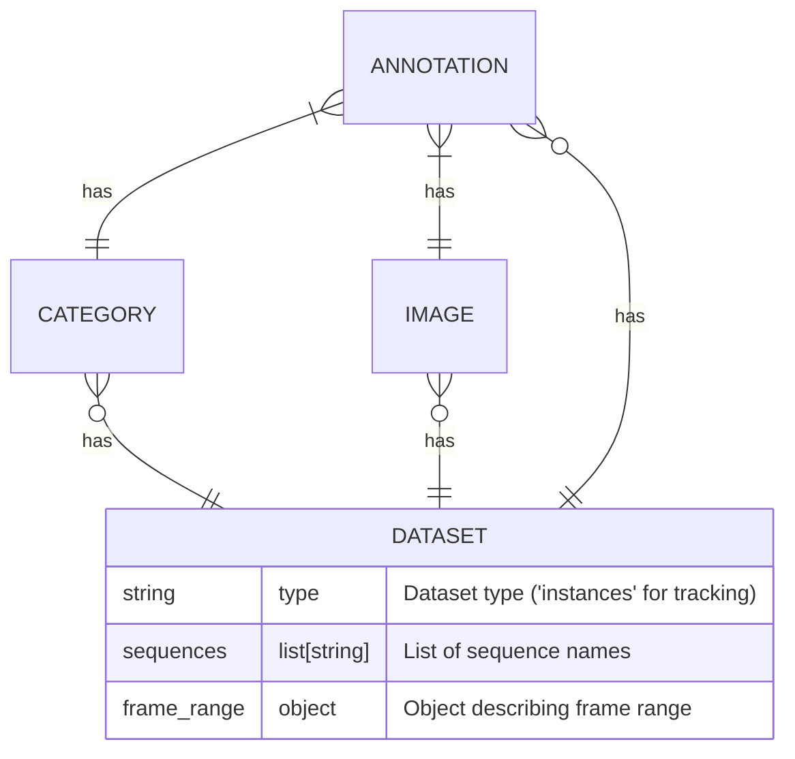
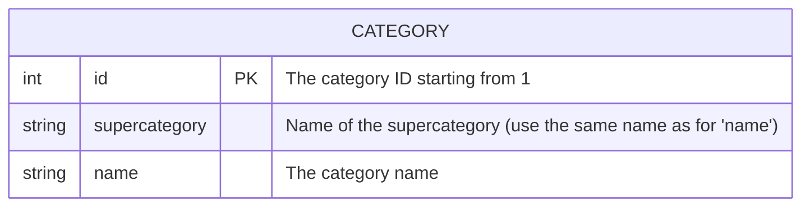
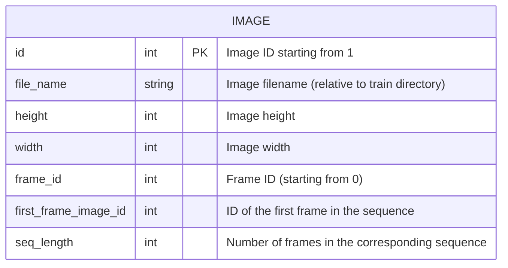
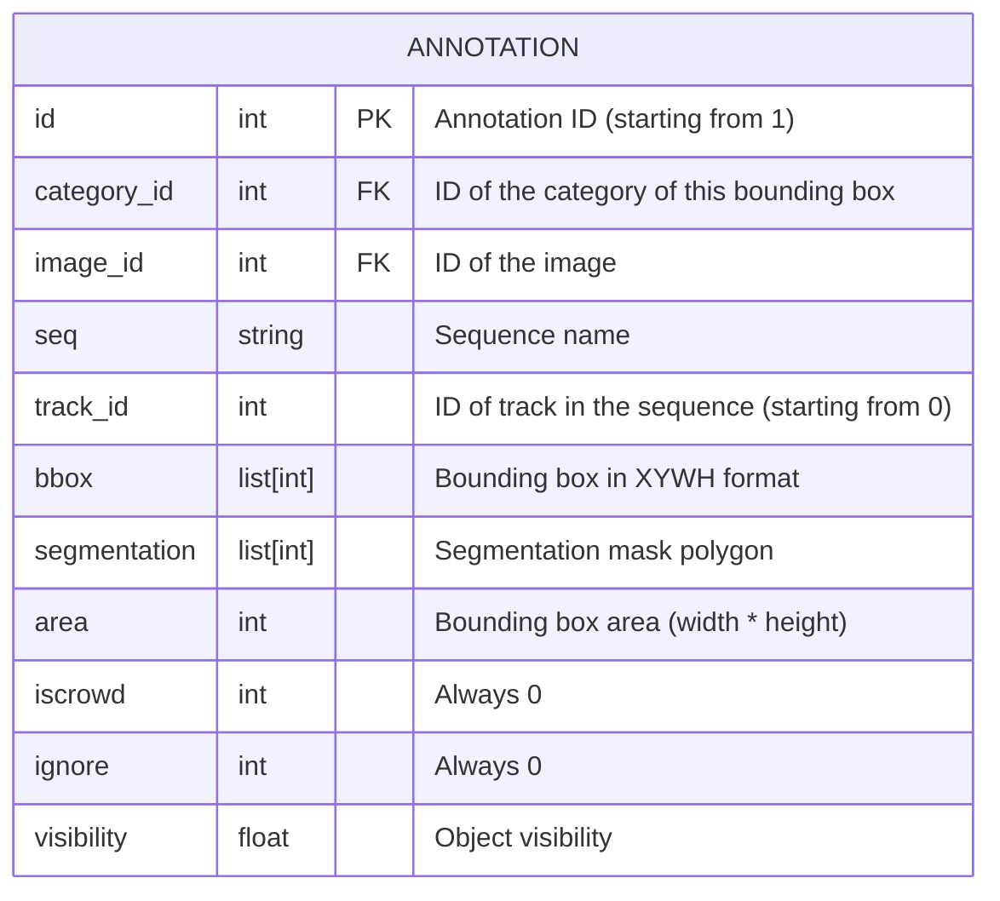

# Trackformer Annotations

Trackformer uses a modified JSON file format for annotating ground truth for multi-object tracking. In this article we will explain this annotation format.

## Annotation format
Sample annotation file

```json
{
    "type": "instances",
    "categories": [
        {
            "supercategory": "spine",
            "name": "spine",
            "id": 1
        },
        ...
    ],
    "images": [
        {
            "file_name": "aid052N1D1_tp1_stack2_layer001.png",
            "height": 512,
            "width": 512,
            "id": 0,
            "first_frame_image_id": 0,
            "seq_length": 20,
            "frame_id": 0
        },
        ...
    ],
    "annotations": [
        {
            "id": 0,
            "category_id": 1,
            "image_id": 3,
            "seq": "aid052N1D1_tp1_stack2",
            "track_id": 0
            "bbox": [
                337,
                473,
                23,
                21
            ],
            "area": 483,
            "segmentation": [],
            "ignore": 0,
            "visibility": 1.0,
            "iscrowd": 0,
        },
        ...
    ],
    "sequences": [
        "aid052N1D1_tp1_stack2",
        ...
    ],
    "frame_range": {
        "start": 0.0,
        "end": 1.0
    }
}
```

### JSON annotation file structure


### Category entities


### Image entities


### Annotation entities


## Convert CSV annotations to Trackformer annotations

We have created a script that can transform tracking annotations in a CSV format described below into the Trackformer JSON annotation format. First you need to create the following directory structure in your `trackformer` directory:

```
data
|- spine_detection
  |- annotations
    |- test.csv
    |- train.csv
    |- val.csv
  |- test
  |- train
  |- val
```

Place your images in the `train`, `val` and `test` directories. Then add your annotations in the CSV files in the following format:

```csv
id,filename,width,height,class,score,xmin,ymin,xmax,ymax
1,aid052N1D2_tp1_stack1_layer006.png,512,512,spine,1.0,445.0,243.0,458.0,263.0
0,aid052N1D2_tp1_stack1_layer006.png,512,512,spine,1.0,339.0,232.0,353.0,245.0
2,aid052N1D2_tp1_stack1_layer006.png,512,512,spine,1.0,326.0,254.0,344.0,270.0
2,aid052N1D2_tp1_stack1_layer007.png,512,512,spine,1.0,327.0,254.0,345.0,270.0
3,aid052N1D2_tp1_stack1_layer007.png,512,512,spine,1.0,464.0,278.0,488.0,306.0
4,aid052N1D2_tp1_stack1_layer007.png,512,512,spine,1.0,496.0,54.0,512.0,76.0
0,aid052N1D2_tp1_stack1_layer007.png,512,512,spine,1.0,338.0,230.0,356.0,245.0
1,aid052N1D2_tp1_stack1_layer007.png,512,512,spine,1.0,443.0,241.0,460.0,261.0
5,aid052N1D2_tp1_stack1_layer008.png,512,512,spine,1.0,217.0,208.0,236.0,248.0
3,aid052N1D2_tp1_stack1_layer008.png,512,512,spine,1.0,463.0,278.0,485.0,304.0
6,aid052N1D2_tp1_stack1_layer008.png,512,512,spine,1.0,259.0,233.0,270.0,248.0
```

`id` is the object identity. It can occur multiple times in a sequence, but only once in a frame.

Now call the following Python script to create JSON annotation files in the `annotation`directory:

```bash
$ python src/generate_coco_from_spine.py
```

After running this command you will find the annotation files `train.json`, `val.json` and `test.json` in the `annotations`directory.