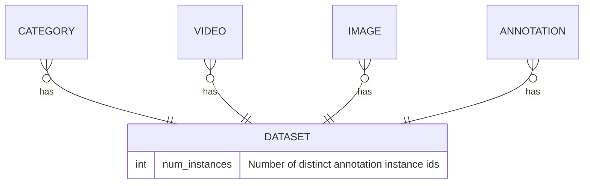
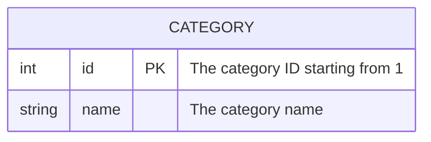
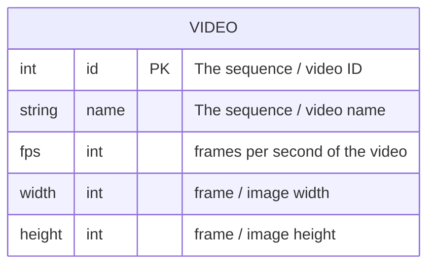
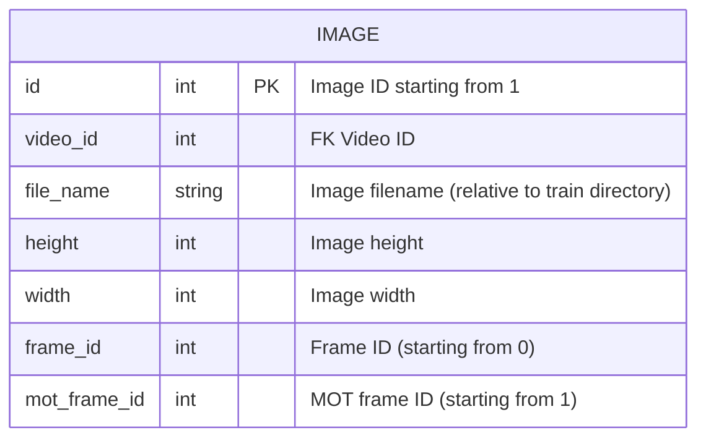
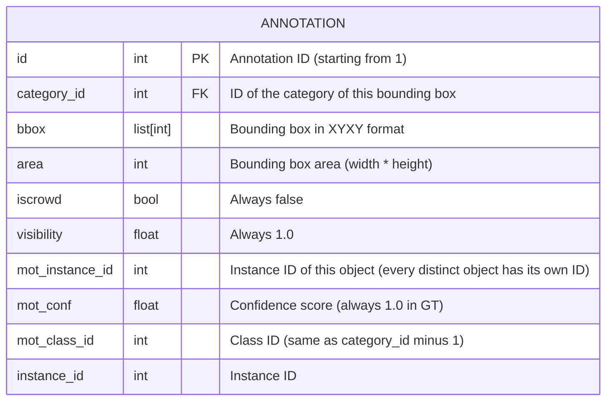

# MMDetection Tracking Dataset

Sample annotation file

```json
{
    "categories": [
        {
            "id": 1,
            "name": "pedestrian"
        }
    ],
    "videos": [
        {
            "id": 1,
            "name": "aid052N1D3_tp1_stack1_default_aug_False_epoch_19_theta_0.5_delta_0.1_Test",
            "fps": 1,
            "width": 512,
            "height": 512
        },
        ...
    ],
    "images": [
        {
            "id": 1,
            "video_id": 1,
            "file_name": "aid052N1D3_tp1_stack1_default_aug_False_epoch_19_theta_0.5_delta_0.1_Test\\img\\000001.png",
            "height": 512,
            "width": 512,
            "frame_id": 0,
            "mot_frame_id": 1
        },
        ...
    ],
    "annotations": [
        {
            "category_id": 1,
            "bbox": [
                22.0,
                129.0,
                18.0,
                14.0
            ],
            "area": 252.0,
            "iscrowd": false,
            "visibility": 1.0,
            "mot_instance_id": 0,
            "mot_conf": 1.0,
            "mot_class_id": 0,
            "id": 1,
            "image_id": 1,
            "instance_id": 0
        },
        ...
    ],
    "num_instances": 784
}
```

## JSON annotation file structure


## Category entities


## Video entities


## Image entities


## Annotation entities
