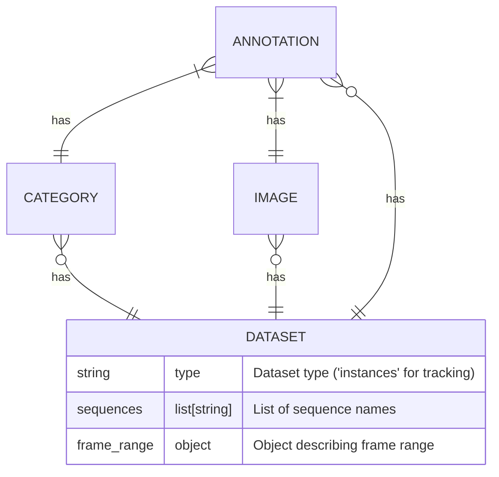
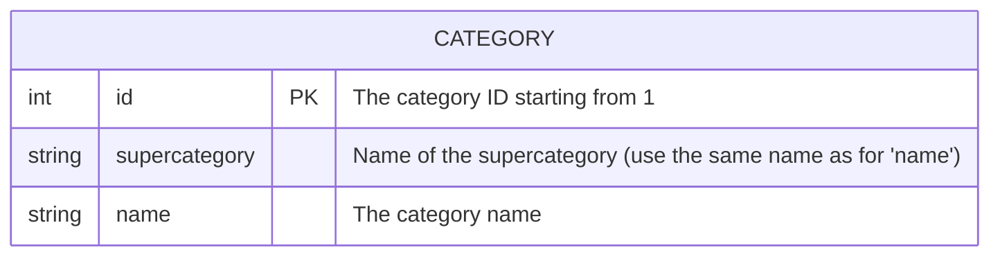
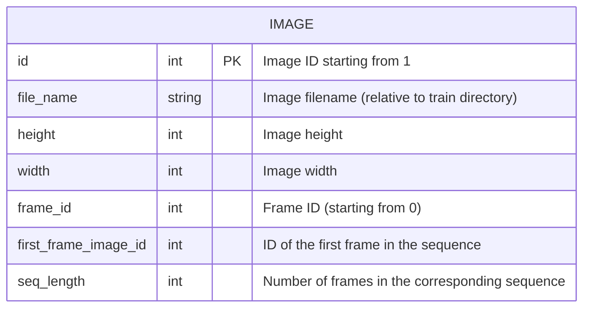
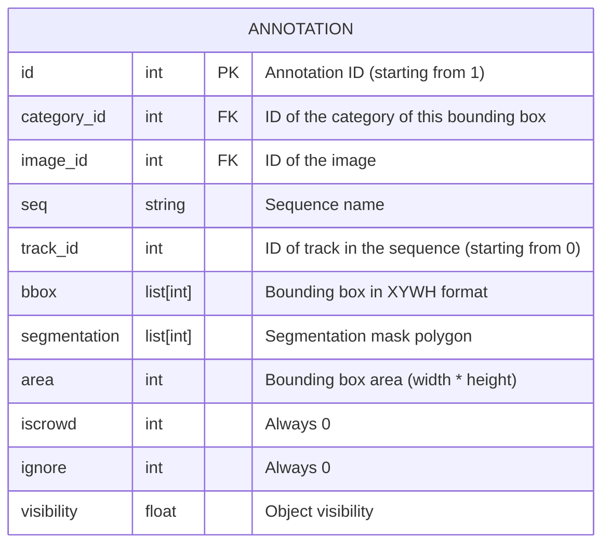

# Trackformer Annotations

Sample annotation file

```json
{
    "type": "instances",
    "categories": [
        {
            "supercategory": "spine",
            "name": "spine",
            "id": 1
        },
        ...
    ],
    "images": [
        {
            "file_name": "aid052N1D1_tp1_stack2_layer001.png",
            "height": 512,
            "width": 512,
            "id": 0,
            "first_frame_image_id": 0,
            "seq_length": 20,
            "frame_id": 0
        },
        ...
    ],
    "annotations": [
        {
            "id": 0,
            "category_id": 1,
            "image_id": 3,
            "seq": "aid052N1D1_tp1_stack2",
            "track_id": 0
            "bbox": [
                337,
                473,
                23,
                21
            ],
            "area": 483,
            "segmentation": [],
            "ignore": 0,
            "visibility": 1.0,
            "iscrowd": 0,
        },
        ...
    ],
    "sequences": [
        "aid052N1D1_tp1_stack2",
        ...
    ],
    "frame_range": {
        "start": 0.0,
        "end": 1.0
    }
}
```

## JSON annotation file structure


## Category entities


## Image entities


## Annotation entities
