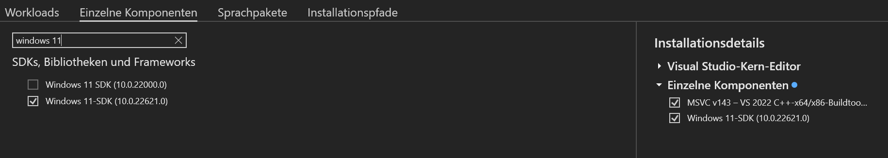

# Setup SpineUI

There are two possible ways to setup SpineUI on your machine. The first way is to use the prebuilt Docker images, which is the way you should prefer if you are not a developer. The second way is to set it up on your machine without using Docker which will require more technical skills.

## Using Docker

### Software Requirements

For using SpineUI you need to have installed Docker on your machine.

### How to start the application

You can start the appliction by running the following command: `docker compose up -d`. When you run the appliaction Docker will download all the required images needed for running this application. It will download one image for the UI and one image per model that is being used.

### Shut down the application

The application can be shut down by executing the command `docker compose down`.


## Without Docker

### Prerequisites

You need to have installed a C++ compier on your machine. This is necessary because otherwise the the MMCV and MMDet libraries cannot be installed on your machine. You should also have installed Python >= 3.10 on your machine as well as the PIP package manager. It is recommended to install Miniconda on your system.

### Create a new Conda environment

First we need to create a new Conda environment.

```bash
$ conda create -n spineui python==3.12 pip
$ conda activate spineui
```

### Clone the GitHub Repository

Clone the GitHub Repository by running the following commands:

```bash
$ git clone https://github.com/TNodeCode/SpineUI
$ cd SpineUI
```

### Install necessary libraries

First we need to install the PyTorch libraries. There is a good interactive tool that can hep you to build the needed installation command <a href="https://pytorch.org" target="_blank">here</a> for the specific environment of your machine (Windows / Mac, CUDA / CPU, etc.). But this command shoud always work if you want to use only the CPU:

```bash
$ pip install torch torchvision torchaudio
```

### Install the MMCV and MMDet libraries

SpineUI is built on top of the <a href="https://github.com/open-mmlab" target="_blank">OpenMMLAB</a> platform and specifically on top of the <a href="https://github.com/open-mmlab/mmcv" target="_blank">MMCV</a> and <a href="https://github.com/open-mmlab/mmdetection" target="_blank">MMDet</a> libraries which are part of this platform. As these libraries are constantly being further developed we included a copy of the source code in this repository that should work for SpineUI. You can find it in the subdirectory `mmcv` of this repository. You can install the MMCV and MMDet libraries with the following commands:

```bash
$ cd mmcv
$ FORCE_CUDA=1 MMCV_WITH_OPS=1 pip install -e . -v
```

Because both libraries contain some C++ code and are compiled ahead of time we need to specify two parameters during compile time.
- `FORCE_CUDA` defines if the libraries shoud be compiled with support for CUDA devices. If you want to support CUDA devices you need to set this parameter to `1`, otherwise set it to `0`. Also you need to have installed the Nvidia C-Compiler `nvcc` on your system as well as CUDA>12.0. When compiling the code a CUDA device must be connected to your machine, otherwise compilation will not work if the parameter is set to 1.
- `MMCV_WITH_OPS` defines whether operators should be compiled. This parameter should be always set to `1`. Otherwise operators won't be compiled and your models are not optimized for the plattform you are running them on. You can do inference without compiling the operators but not training.

### Install other Python libraries

Now we need to install some more Python libraries. The needed Python libraries are defined in the file `requirements.txt`. You can install them by running the following command:

```bash
$ pip install -r requirements.txt
```

## Common errors when installing MMCV

```
ModuleNotFoundError: No module named 'mmcv._ext'
```

This means that the MMCV operators were not compiled, which is ok for inference but not for training. The mmcv operators are actually written in C++ for performance reasons. Python can call compiled C++ code via the `_ext` interface. The solution is to first uninstall the existing mmcv version with the command pip uninstall mmcv and then reinstall the library using this command: `FORCE_CUDA=0 MMCV_WITH_OPS=1 pip install -e . -v`. If CUDA is available on your system then you should set `FORCE_CUDA` to `1`. Then the operators are also compiled against the nvcc CUDA compiler and can be executed on any CUDA hardware.

## Installing a C++ compiler

### On Linux

On Linux it is pretty easy to install a C++ compiler. Run the following command:

```bash
$ sudo apt-get update && sudo apt-get install -y g++
```

### On Windows

On Windows machines you need to have instaled the Visual Studio Community edition. You can install a compiler by installing the Microsoft Build Tools on your PC (<a href="https://visualstudio.microsoft.com/de/visual-cpp-build-tools/" target="_blank">Microsoft Build Tools für C++ - Visual Studio</a>). Switch to the “single compoents” tab in the installer and check the option "Windows 11 SDK" (or "Windows 10 SDK" if you are working with Windows 10).

